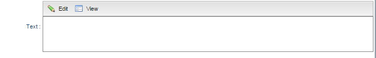
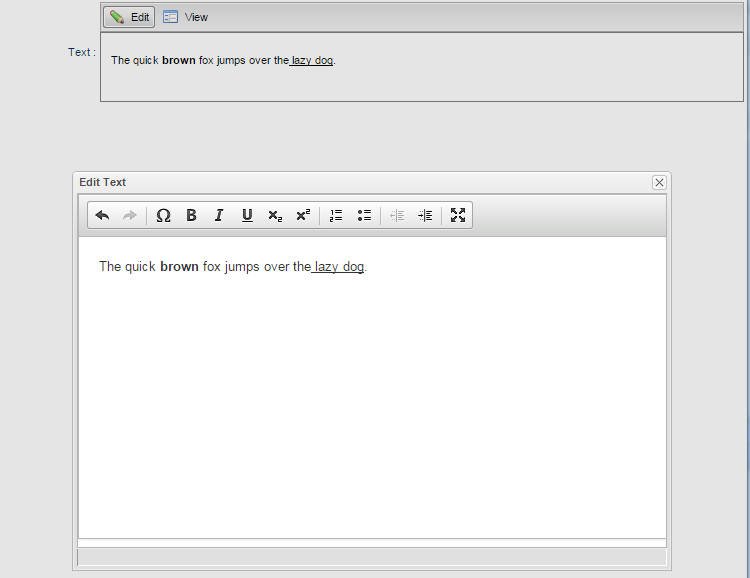

# SmartCKEditor: A SmartGWT module to include CKEditor as FormItem in a SmartGWT application.

## Instructions:

### Prerequisities: 

SmartCKEditor module depends on `GWT 2.7` and `SmartGWT 5.0` versions. Your project should be compliant with these versions.

### Build SmartCKEditor JAR and install in your local repo:
 
Install in your local maven repo, SmartGWT's latest library by executing:

	mvn com.isomorphic:isc-maven-plugin:install -Dproduct=SMARTGWT -Dlicense=LGPL -DbuildNumber=5.0p

Compile project as jar and install it in your local repo: 

`mvn clean install` 

### Include SmartCKEditor in your SmartGWT Project:

Add in your project's `pom.xml` the dependency as: 

	<dependency>
		<groupId>com.pleft</groupId>
		<artifactId>smartckeditor</artifactId>
		<version>1.0-SNAPSHOT</version>
	</dependency>

Include it in your SmartGWT project, open `YourModuleName.gwt.xml` file and add the following line:

	<inherits name='com.pleft.SmartCKEditor' />

Include js dependencies, open your project's starting html page locate the following:

	
  	
  	
  	
  	
  	
  	
  	
  	
  	

and add:

	

### Usage:

SmartCKEditor can be used as a normal `FormItem` in a SmartGWT `DynamicForm`. A code snippet can be the following:

	public void onModuleLoad() {
		DynamicForm form = new DynamicForm();
    	CKEditorWindowItem ckEditorWindowItem = new CKEditorWindowItem("ckEditor");
    	ckEditorWindowItem.setWidth("100%");
    	form.setFields(ckEditorWindowItem);

    	VLayout vLayout = new VLayout();
    	vLayout.setWidth100();
    	vLayout.addMember(form);
    	vLayout.draw();
	}

creates the following form:

upon clicking on the `Edit` button a modal window including the CKEditor appears.

